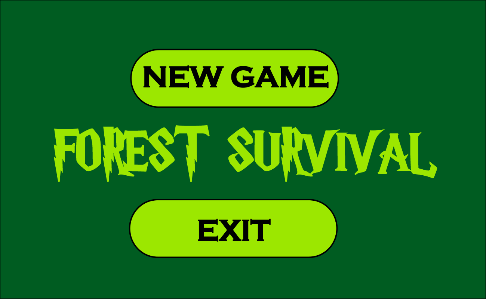
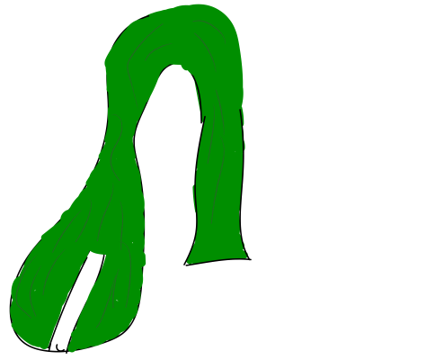
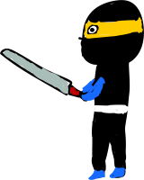
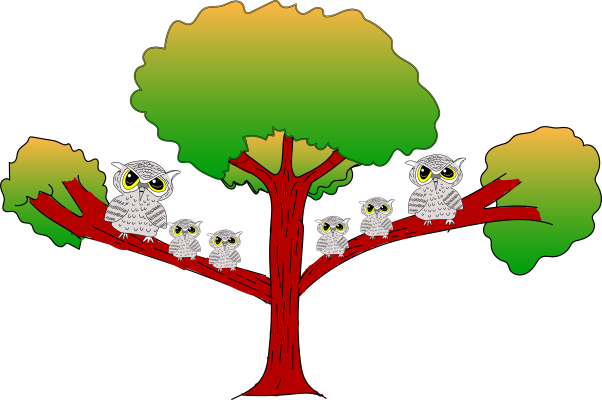
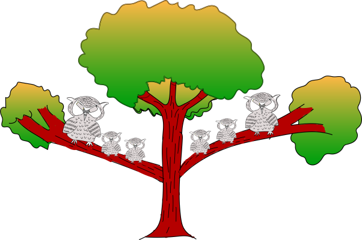

# 🌲 Forest Survival – GameJam 2023 Project



**Forest Survival** is an intense 2D action-survival platformer game developed using **Pygame** for the **2023 Game Jam**. Navigate through a dangerous forest filled with mystical creatures, deadly obstacles, and challenging enemies while testing your reflexes and survival instincts.

---

## 📖 Table of Contents

- [🎮 Game Overview](#-game-overview)
- [✨ Key Features](#-key-features)
- [🎯 Game Mechanics](#-game-mechanics)
- [🕹️ Controls & Gameplay](#️-controls--gameplay)
- [⚔️ Enemies & Obstacles](#️-enemies--obstacles)
- [🏆 Scoring System](#-scoring-system)
- [🚀 Installation & Setup](#-installation--setup)
- [📁 Project Structure](#-project-structure)
- [🎨 Assets Overview](#-assets-overview)
- [🔧 Technical Details](#-technical-details)
- [🎵 Audio System](#-audio-system)
- [🖼️ Visual Elements](#️-visual-elements)
- [🐛 Game States](#-game-states)
- [⚙️ Configuration](#️-configuration)
- [🤝 Contributing](#-contributing)

---

## 🎮 Game Overview

Forest Survival is a fast-paced side-scrolling survival game where players control a warrior navigating through an enchanted forest. The game features multiple layers of parallax scrolling backgrounds, dynamic enemy encounters, and a progressive difficulty system that challenges players to survive as long as possible.

### 🎯 Objective
- Survive in the dangerous forest for as long as possible
- Dodge various enemies and obstacles using different movement abilities
- Manage your shield strategically to block attacks
- Achieve the highest score possible through continuous survival

### ✨ Key Features

- **Multi-layered Parallax Scrolling**: Beautiful 3-layer background system creating depth
- **Dynamic Enemy System**: Multiple enemy types with unique attack patterns
- **Progressive Difficulty**: Game speed increases as your score grows
- **Strategic Shield System**: Adjustable shield positions for tactical gameplay
- **Rich Audio Experience**: Immersive sound effects and background music
- **Smooth Animations**: Frame-based character and enemy animations
- **Health System**: 3-life system with visual health indicators
- **Pause System**: Full game pause functionality with menu options

---

## 🎯 Game Mechanics

### ❤️ Health System
- **3 Lives**: Players start with 3 health points
- **Health Visualization**: Heart icons display current health
- **Damage System**: Each enemy hit reduces health by 1
- **Game Over**: Occurs when all lives are lost

### 🛡️ Shield System
- **Toggle Shield**: Press `S` to activate/deactivate shield
- **3 Positions**: Top, Middle, Bottom shield positioning
- **Strategic Blocking**: Shield must be positioned correctly to block attacks
- **Visual Feedback**: Shield position indicated by on-screen graphics

### 📈 Progressive Difficulty
- **Level 1 (0-99 points)**: Normal speed
- **Level 2 (100-199 points)**: Increased movement speed (2x)
- **Level 3 (200+ points)**: Maximum speed (3x) with faster wizard attacks

### ⏱️ Timing Mechanics
- **Animation Cycles**: Character and enemy sprites use time-based animations
- **Attack Patterns**: Enemies have specific timing windows for attacks
- **Invincibility Frames**: Brief protection period after taking damage

---

## 🕹️ Controls & Gameplay

### 🎮 Keyboard Controls

| Key | Action | Description |
|-----|--------|-------------|
| `SPACE` | Move Forward | Advances the game world and player |
| `J` | Jump | Makes player jump over obstacles |
| `D` | Slide/Duck | Slides under attacks and obstacles |
| `S` | Toggle Shield | Activates/deactivates protective shield |
| `↑` / `LEFT` | Shield Up | Positions shield at top level |
| `↓` | Shield Middle | Positions shield at middle level |
| `→` / `RIGHT` | Shield Down | Positions shield at bottom level |
| `A` | Sword Attack | Brief sword animation (visual only) |

### 🖱️ Mouse Controls

| Action | Function |
|--------|----------|
| **Mouse Wheel Up** | Move shield position up |
| **Mouse Wheel Down** | Move shield position down |
| **Left Click** | Menu navigation and interactions |
| **Pause Button Click** | Pause/unpause game |

### 🎛️ Menu Navigation

- **Main Menu**: Click "Start Game" or press `SPACE`
- **Pause Menu**: Click pause button (top-right) during gameplay
- **Music Toggle**: Click music icon in top-right corner
- **Game Over**: Click restart to play again

---

## ⚔️ Enemies & Obstacles

### 🌳 Danger Tree

- **Behavior**: Animated tree that poses a collision threat
- **Animation**: 4-frame animation cycle creating menacing movement
- **Avoidance**: Jump over or slide under depending on timing
- **Danger Level**: Medium - requires precise timing

### 🧙‍♂️ Wizard

- **Behavior**: Flies across the screen at medium height
- **Attack Pattern**: Cannot be blocked, only avoided
- **Avoidance**: Must slide/duck to avoid
- **Warning System**: "Be prepared!!! Wizard is coming" message
- **Frequency**: Appears every 5-8 seconds after initial delay

### 🐊 Crocodile

- **Behavior**: Ground-level threat that moves horizontally
- **Attack Pattern**: Low-level attack that requires jumping
- **Avoidance**: Jump to clear the crocodile
- **Spawn**: Random intervals with repositioning after passing

### 🥷 Ninja (Boss Enemy)
 
- **Behavior**: Most complex enemy with multiple phases
- **Phase 1**: Approaches from distance with palace background
- **Phase 2**: Launches projectile attacks at 3 different heights
- **Phase 3**: Close combat with jumping attacks
- **Strategy**: Use shield to block projectiles, then jump over ninja
- **Audio Cues**: Attack sounds and warning sirens
- **Immunity**: Disables other enemies during encounter

### 🦉 Owl Tree
 
- **Behavior**: Decorative animated tree with owl
- **Animation**: Owl opens and closes eyes periodically
- **Threat Level**: None - purely visual element

---

## 🏆 Scoring System

### 📊 Score Calculation
- **Base Points**: 1 point per 10 movement steps
- **Continuous Scoring**: Score increases while moving forward
- **No Bonus Points**: Survival time is the primary scoring metric

### 🎖️ Level Progression
- **Level 1**: 0-99 points (Normal difficulty)
- **Level 2**: 100-199 points (Speed increase, level-up music)
- **Level 3**: 200+ points (Maximum difficulty)

### ⏰ Time Tracking
- **Game Timer**: Displays elapsed time in MM:SS format
- **Pause Functionality**: Timer pauses during game pause
- **Final Score**: Shown on game over screen

---

## 🚀 Enhanced Edition Features

This enhanced version includes comprehensive new systems built on top of the original game:

### 🏗️ Master Game Engine
- **Unified System Architecture**: Centralized engine managing all game systems
- **Priority-Based Updates**: Performance-optimized update ordering
- **Event-Driven Communication**: Decoupled system interactions
- **Automatic Error Recovery**: Self-healing system with fallback mechanisms
- **Performance Monitoring**: Real-time system performance tracking

### 🧪 Comprehensive Testing Framework
- **Multi-Type Testing**: Unit, integration, performance, and stress tests
- **Automated Test Execution**: Full test suite with detailed reporting
- **Bug Tracking System**: Professional issue management with auto-resolution
- **7-Phase Integration Process**: Systematic validation from initialization to deployment

### 📊 Advanced Systems Integration
- **Foundation Systems**: Enhanced core architecture and utilities
- **Core Gameplay**: Advanced mechanics and player interactions
- **UI/UX Enhancements**: Polished interface and user experience
- **Scene Management**: Professional scene transitions and state handling
- **Visual Polish**: Advanced effects, particles, and animations
- **Final Integration**: Complete system coordination and optimization

### 🔧 Development Tools
- **Automatic Bug Resolution**: AI-powered issue detection and fixing
- **Performance Optimization**: Real-time system performance analysis
- **Code Quality Assurance**: Comprehensive validation and testing
- **Professional Documentation**: Complete API and developer guides

To experience the enhanced edition with all these features:
```bash
python src/master_game_engine.py
```

---

## 🚀 Installation & Setup

### 📋 Prerequisites

```bash
# Python 3.7 or higher
python --version

# Pygame library
pip install pygame
```

### 💻 Running the Game

#### Option 1: Original Game
```bash
# Navigate to game directory
cd Forest_Survival_GameJam2023_Project

# Run the original game
python main.py
```

#### Option 2: Enhanced Edition (Recommended)
```bash
# Run the enhanced game with all new systems
python src/master_game_engine.py
```

#### Option 3: Executable (Windows)
```bash
# Double-click main.exe or run from command line
./main.exe
```

### 🔧 Development Setup

```bash
# Clone the repository
git clone https://github.com/TAR2003/Forest_Survival_GameJam2023_Project.git

# Navigate to project directory
cd Forest_Survival_GameJam2023_Project

# Install dependencies
pip install pygame

# Run in development mode
python main.py
```

---

## 📁 Project Structure

```
Forest_Survival_GameJam2023_Project/
│
├── main.py                    # Main game file (1074 lines of code)
├── main.exe                   # Compiled executable
├── README.md                  # This documentation file
│
├── audio/                     # Sound effects and music
│   ├── attack.wav            # Ninja attack sound
│   ├── bombsound.wav         # Explosion effects
│   ├── bounce.wav            # Bounce sound effect
│   ├── bulletsound.wav       # Projectile sound
│   ├── bunce.wav             # Alternative bounce
│   ├── celebrate.wav         # Victory sound
│   ├── click.wav             # UI click sound
│   ├── fall.wav              # Falling sound
│   ├── ingame.wav            # In-game background music
│   ├── jump.wav              # Jump sound effect
│   ├── levelup.wav           # Level progression sound
│   ├── monshout.wav          # Monster shout
│   ├── monstershout.wav      # Alternative monster sound
│   ├── mont.wav              # Monster ambient
│   ├── move.wav              # Movement sound
│   ├── siren.wav             # Warning siren
│   ├── slide.wav             # Sliding sound
│   ├── string.wav            # String instrument
│   └── theme.wav             # Main theme music
│
├── pictures/                  # Visual assets
│   ├── bg.png                # Main background
│   ├── bgfront1strow.png     # Foreground layer 1
│   ├── bgfront2ndrow.png     # Foreground layer 2
│   ├── bgfront3rdrow.png     # Foreground layer 3
│   ├── careful.png           # Warning message
│   ├── croc.png              # Crocodile sprite
│   ├── gameover.png          # Game over screen
│   ├── gun.png               # Weapon sprite
│   ├── health.png            # Health heart icon
│   ├── justgreen.png         # Green background fill
│   ├── musicno.png           # Music off icon
│   ├── musicyes.png          # Music on icon
│   ├── newgame.png           # Main menu background
│   ├── ninja.png             # Ninja enemy sprite
│   ├── ninjaattack.png       # Ninja attack animation
│   ├── owl.ai                # Owl vector file
│   ├── palace.png            # Ninja's palace background
│   ├── pause.png             # Pause menu background
│   ├── pauselogo.png         # Pause button icon
│   ├── sword.png             # Sword weapon
│   ├── template.png          # Template image
│   ├── walkway.png           # Ground/platform texture
│   ├── weapon.png            # Projectile weapon
│   ├── wizard.png            # Wizard enemy sprite
│   │
│   ├── player/               # Player character sprites
│   │   ├── 1.png            # Animation frame 1
│   │   ├── 2.png            # Animation frame 2
│   │   ├── 3.png            # Animation frame 3
│   │   ├── 4.png            # Animation frame 4
│   │   ├── playerduck.png   # Ducking animation
│   │   ├── playeronairright.png    # Jumping right
│   │   ├── playeronairrleftt.png   # Jumping left
│   │   ├── playerrunleft.png       # Running left
│   │   ├── playerrunright.png      # Running right
│   │   ├── playerstanding.png      # Standing pose
│   │   └── SHIELD.png       # Shield equipment
│   │
│   └── trees/                # Tree and forest sprites
│       ├── dangertree1.png   # Danger tree frame 1
│       ├── dangertree2.png   # Danger tree frame 2
│       ├── dangertree3.png   # Danger tree frame 3
│       ├── dangertree4.png   # Danger tree frame 4
│       ├── pine1.png         # Pine tree frame 1
│       ├── pine2.png         # Pine tree frame 2
│       ├── pine3.png         # Pine tree frame 3
│       ├── pine4.png         # Pine tree frame 4
│       ├── treenormal.png    # Standard tree
│       ├── treeorange.png    # Orange tree variant
│       ├── treepink.png      # Pink tree variant
│       ├── treepink2.png     # Pink tree variant 2
│       ├── treered.png       # Red tree variant
│       ├── treewithdalpala.png       # Tree with decorations
│       ├── treewithdalpalapink.png   # Pink decorated tree
│       ├── treewithdalpalared.png    # Red decorated tree
│       ├── treewithdalpalayellow.png # Yellow decorated tree
│       ├── treewithowlclosed.png     # Owl tree (closed)
│       ├── treewithowlopen.png       # Owl tree (open)
│       └── treeyellow.png    # Yellow tree variant
│
├── src/                      # Enhanced systems source code
│   ├── master_game_engine.py         # Main enhanced game engine
│   │
│   ├── foundation/                    # Phase 1: Foundation Systems
│   │   ├── core_architecture.py      # Enhanced core game architecture
│   │   ├── enhanced_utilities.py     # Advanced utility functions
│   │   └── system_foundation.py      # System integration foundation
│   │
│   ├── gameplay/                      # Phase 2: Core Gameplay Enhancement
│   │   ├── advanced_mechanics.py     # Enhanced game mechanics
│   │   ├── player_enhancements.py    # Advanced player systems
│   │   └── gameplay_core.py          # Core gameplay improvements
│   │
│   ├── ui_ux/                        # Phase 3: UI/UX Enhancement
│   │   ├── enhanced_ui.py            # Advanced user interface
│   │   ├── user_experience.py        # UX improvements
│   │   └── interface_polish.py       # UI polish and effects
│   │
│   ├── scenes/                       # Phase 4: Scene Management
│   │   ├── scene_management.py       # Professional scene handling
│   │   ├── scene_transitions.py      # Smooth scene transitions
│   │   └── scene_polish.py           # Scene enhancement systems
│   │
│   ├── effects/                      # Phase 5: Polish & Effects
│   │   ├── visual_effects.py         # Advanced visual effects
│   │   ├── audio_polish.py           # Enhanced audio systems
│   │   └── game_polish.py            # General game polish
│   │
│   ├── testing/                      # Phase 6: Testing & Integration
│   │   ├── comprehensive_test_suite.py    # Complete testing framework
│   │   ├── bug_tracking.py               # Professional bug management
│   │   └── final_integration.py          # Integration coordinator
│   │
│   ├── states/              # Game state management (legacy)
│   ├── ui/                  # User interface components (legacy)
│   └── utils/               # Utility functions (legacy)
│
└── __pycache__/             # Python compiled files
```

---

## 🎨 Assets Overview

### 🎵 Audio Assets (18 files)

#### 🎶 Music Files
- **`theme.wav`**: Main menu background music with looping
- **`ingame.wav`**: In-game background music for action sequences
- **`string.wav`**: Atmospheric string music for game over

#### 🔊 Sound Effects
- **Movement**: `jump.wav`, `slide.wav`, `move.wav`
- **Combat**: `attack.wav`, `bulletsound.wav`, `bombsound.wav`
- **UI**: `click.wav`, `celebrate.wav`
- **Ambient**: `siren.wav`, `monshout.wav`, `monstershout.wav`
- **Progression**: `levelup.wav`

### 🖼️ Visual Assets (45+ files)

#### 🌄 Background Elements
- **Multi-layer parallax system** with 3 scrolling speeds
- **Seamless looping** backgrounds for infinite scrolling
- **Depth illusion** created through layer movement speeds

#### 👤 Character Sprites
- **8 player animations** including standing, running, jumping, ducking
- **Shield equipment** with position indicators
- **Weapon sprites** for sword and gun elements

#### 🌲 Environmental Assets
- **20+ tree variations** including animated pine trees
- **Danger tree** with 4-frame animation cycle
- **Owl tree** with opening/closing animation

#### 👾 Enemy Sprites
- **Ninja** with normal and attack poses
- **Wizard** with flying animation
- **Crocodile** ground-level threat
- **Palace background** for ninja encounters

---

## 🔧 Technical Details

### 🏗️ Architecture

#### Class Structure
```python
class player(pygame.sprite.Sprite):
    # Player character with animations, jumping, shield management
    
class ninja(pygame.sprite.Sprite):
    # Complex enemy with projectile attacks and jumping
    
class wizard(pygame.sprite.Sprite):
    # Flying enemy with timed appearances
    
class owltree(pygame.sprite.Sprite):
    # Animated decorative element
    
class dangertree(pygame.sprite.Sprite):
    # Animated hazardous obstacle
    
class alltrees(pygame.sprite.Sprite):
    # Background tree management and parallax scrolling
```

#### Game Loop Structure
1. **Event Handling**: Input processing and menu interactions
2. **Game State Management**: Menu, playing, pause, game over states
3. **Entity Updates**: Player, enemies, and background elements
4. **Collision Detection**: Player-enemy interaction checking
5. **Rendering**: Multi-layer sprite drawing
6. **Audio Management**: Music and sound effect playback

### ⚡ Performance Features

- **60 FPS Target**: Consistent frame rate using `pygame.time.Clock()`
- **Efficient Sprite Management**: Sprite groups for optimized rendering
- **Memory Management**: Proper image loading and caching
- **Collision Optimization**: Strategic hit-box checking

### 🎮 Game States

#### State Machine
```
MENU → PLAYING → PAUSE → PLAYING
  ↓       ↓        ↓
QUIT   GAMEOVER → RESET → MENU
```

#### State Transitions
- **Menu to Playing**: Space key or mouse click
- **Playing to Pause**: Pause button click
- **Playing to Game Over**: Health reaches 0
- **Any State to Quit**: Window close or quit button

---

## 🎵 Audio System

### 🔊 Sound Management

#### Audio Loading and Configuration
```python
# Music volume control
thememusic.set_volume(0.1)
ingamemusic.set_volume(0.1)
overmusic.set_volume(0.1)

# Sound effect volumes
click.set_volume(0.3)
jumpmusic.set_volume(0.05)
levelup.set_volume(0.08)
```

#### Dynamic Audio Features
- **Context-sensitive music**: Different tracks for menu, gameplay, game over
- **Interactive sound effects**: Immediate feedback for all player actions
- **Audio toggles**: Player can enable/disable music via UI
- **Looping system**: Background music with seamless loops

### 🎶 Audio Cues
- **Warning Systems**: Siren sounds for approaching ninja
- **Feedback Loops**: Distinct sounds for jump, slide, attack actions
- **Atmospheric Audio**: Monster sounds and ambient forest audio

---

## 🖼️ Visual Elements

### 🎨 Graphics Pipeline

#### Parallax Scrolling System
```python
# Background layer speeds (relative to player movement)
bg_layer1_speed = change_bg * 1    # Slowest (background)
bg_layer2_speed = change_bg * 2    # Medium (midground)  
bg_layer3_speed = change_bg * 5    # Fast (foreground)
walkway_speed = change_bg * 13     # Fastest (ground)
```

#### Animation Systems
- **Time-based animations**: Using `pygame.time.get_ticks()` for frame timing
- **Cyclical animations**: Modulo operations for looping animations
- **State-based sprites**: Different sprites for different player states

#### Visual Feedback
- **Health indicators**: Heart sprites showing remaining lives
- **Shield positioning**: Visual representation of shield state
- **Warning messages**: Text overlays for incoming threats
- **Score display**: Real-time score and timer information

---

## 🐛 Game States

### 🎯 State Management Details

#### Menu State (`mode = 'menu'`)
- **Background**: Main menu image with game title
- **Music**: Theme music on loop
- **Interactions**: Start game, toggle music, quit
- **Visual Elements**: Music toggle icons, clickable areas

#### Playing State (`mode = 'playingday'`)
- **Background**: Multi-layer parallax forest
- **Music**: In-game background music
- **Active Elements**: All enemies, player, environmental hazards
- **UI Elements**: Health, score, timer, controls help

#### Pause State (`mode = 'pause'`)
- **Background**: Pause menu overlay
- **Music**: Theme music resumes
- **Options**: Resume, new game, reset, quit
- **Timer**: Game timer pauses, preserving elapsed time

#### Game Over State (`mode = 'gameover'`)
- **Background**: Game over screen
- **Score Display**: Final score presentation
- **Music**: Game over theme
- **Options**: Restart game option

---

## ⚙️ Configuration

### 🎛️ Game Settings

#### Display Configuration
```python
SCREEN_WIDTH = 1300
SCREEN_HEIGHT = 800
FPS = 60
WINDOW_TITLE = "Forest Survival"
```

#### Gameplay Constants
```python
PLAYER_HEALTH = 3
GRAVITY_ACCELERATION = 2
JUMP_VELOCITY = -30
NINJA_JUMP_VELOCITY = -14
```

#### Difficulty Scaling
```python
# Level progression thresholds
LEVEL_2_THRESHOLD = 100
LEVEL_3_THRESHOLD = 200

# Speed multipliers per level
LEVEL_1_SPEED = 1
LEVEL_2_SPEED = 2  
LEVEL_3_SPEED = 3
```

### 🔧 Customization Options

#### Audio Settings
- Music can be toggled on/off via UI
- Individual sound effect volume levels
- Audio mute functionality

#### Control Remapping
Currently using fixed controls, but the code structure supports easy remapping of keyboard inputs.

---

## 🤝 Contributing

### 📝 Development Guidelines

1. **Code Style**: Follow Python PEP 8 conventions
2. **Comments**: Add descriptive comments for complex game logic
3. **Testing**: Test all game states and transitions
4. **Assets**: Ensure new assets follow existing naming conventions

### 🔄 Suggested Improvements

#### Gameplay Enhancements
- **Power-ups**: Temporary abilities like invincibility or double jump
- **Multiple Characters**: Different playable characters with unique abilities
- **Achievement System**: Unlock system for reaching certain milestones
- **Difficulty Selection**: Player-selectable difficulty levels

#### Technical Improvements
- **Config File**: External configuration for game settings
- **Save System**: High score persistence
- **Resolution Scaling**: Support for different screen resolutions
- **Mobile Support**: Touch controls for mobile devices

#### Content Additions
- **New Enemies**: Additional enemy types with unique mechanics
- **Boss Battles**: Structured boss encounters with multiple phases
- **Environmental Hazards**: Weather effects, terrain changes
- **Story Mode**: Narrative-driven progression system

### 🐛 Bug Reports

When reporting bugs, please include:
- **Operating System**: Windows/Mac/Linux version
- **Python Version**: Python version used
- **Pygame Version**: Pygame library version
- **Steps to Reproduce**: Detailed reproduction steps
- **Expected Behavior**: What should happen
- **Actual Behavior**: What actually happens

---

## 📊 Technical Specifications

### 💻 System Requirements

#### Minimum Requirements
- **OS**: Windows 7/8/10/11, macOS 10.12+, or Linux
- **Python**: 3.7 or higher
- **RAM**: 512 MB available memory
- **Storage**: 50 MB available space
- **Graphics**: DirectX 9.0c compatible

#### Recommended Requirements
- **OS**: Windows 10/11, macOS 11.0+, or Ubuntu 20.04+
- **Python**: 3.9 or higher
- **RAM**: 1 GB available memory
- **Storage**: 100 MB available space
- **Audio**: DirectSound compatible sound card

### 📈 Performance Metrics

- **Target Frame Rate**: 60 FPS
- **Memory Usage**: ~50-100 MB during gameplay
- **Startup Time**: <3 seconds on modern hardware
- **Asset Loading**: <1 second for all game resources

---

## 🏆 Game Statistics

### 📊 Content Overview

- **Total Code Lines**: 1,074 lines in main.py
- **Audio Files**: 18 sound effects and music tracks
- **Image Assets**: 45+ sprites and backgrounds
- **Enemy Types**: 4 unique enemy classes
- **Animation Frames**: 20+ character and environment animations
- **Game States**: 5 distinct game states
- **Difficulty Levels**: 3 progressive difficulty levels

### 🎮 Gameplay Features

- **Infinite Survival**: Endless gameplay with increasing difficulty
- **Multi-layered Combat**: Jump, slide, and shield mechanics
- **Strategic Gameplay**: Timing and positioning requirements
- **Progressive Challenge**: Adaptive difficulty scaling
- **Immersive Audio**: Full sound design with music and effects

---

## 📚 Learning Resources

### 🎓 Pygame Development
- **Official Pygame Documentation**: [pygame.org](https://pygame.org)
- **Python Game Development**: Explore sprite manipulation and game loops
- **2D Graphics Programming**: Understanding coordinate systems and transformations

### 🎮 Game Design Concepts
- **Parallax Scrolling**: Multi-layer background movement techniques
- **State Machines**: Game state management patterns
- **Collision Detection**: Sprite intersection and hit-box systems
- **Audio Integration**: Sound effect timing and music loops

---

## 🌟 Acknowledgments

- **Game Jam 2023**: Created as part of the 2023 Game Jam event
- **Pygame Community**: For the excellent 2D game development framework
- **Open Source Assets**: Community-created sprites and audio (where applicable)
- **Beta Testers**: Community feedback for gameplay balance

---

## 📞 Contact & Support

### 🔗 Links
- **Repository**: [GitHub - Forest_Survival_GameJam2023_Project](https://github.com/TAR2003/Forest_Survival_GameJam2023_Project)
- **Issues**: Report bugs and request features via GitHub Issues
- **Developer**: TAR2003

### 📧 Support
For technical support, gameplay questions, or contribution inquiries, please use the GitHub repository's issue tracking system.

---

## 📄 License

This project is developed as part of Game Jam 2023. Please refer to the repository for specific licensing information.

---

**🌲 Enter the Forest. Survive the Challenge. Become the Legend. 🛡️⚔️**

*Last Updated: December 2024*
